Voici un projet d'étude qui démontre mon savoir faire avec le Langage de Modélisation Unifié  
ainsi que la géstion d'une base de donnée SQL.

# * SCHEMAS UML EXPRESSFOOD*
 

## Sommaire
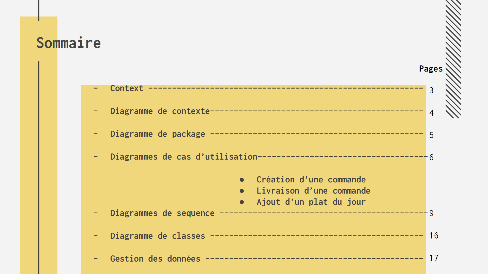

## Contexte
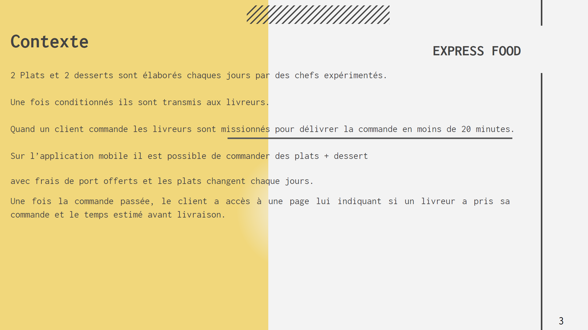

### Diagramme de contexte
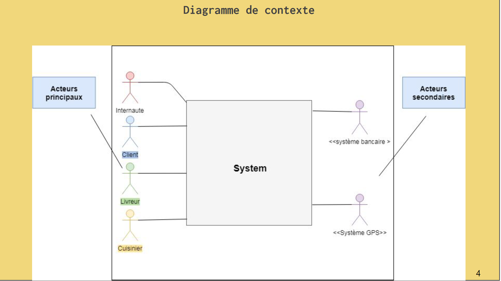

### Diagramme de package
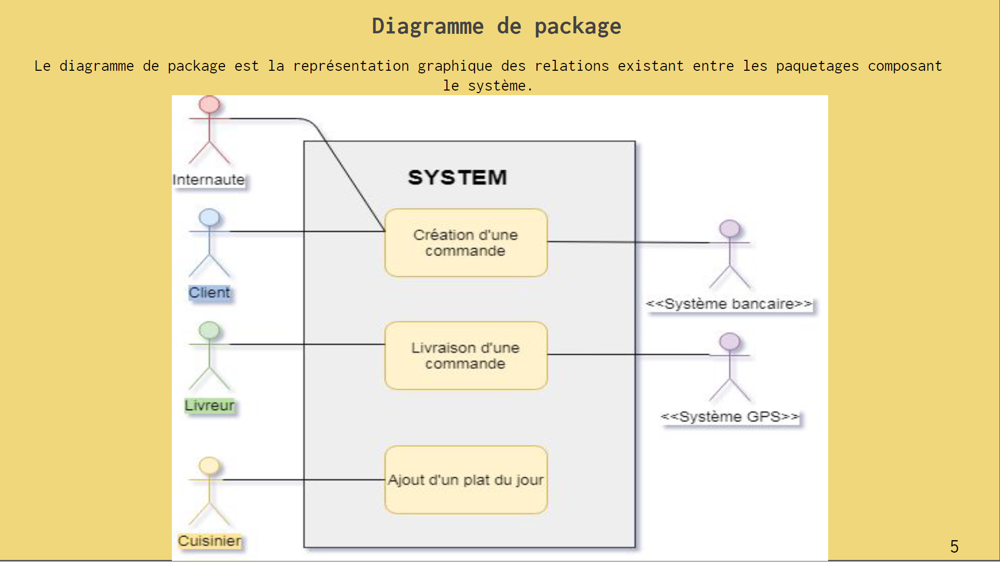

### Diagrammes de cas d'utilisation
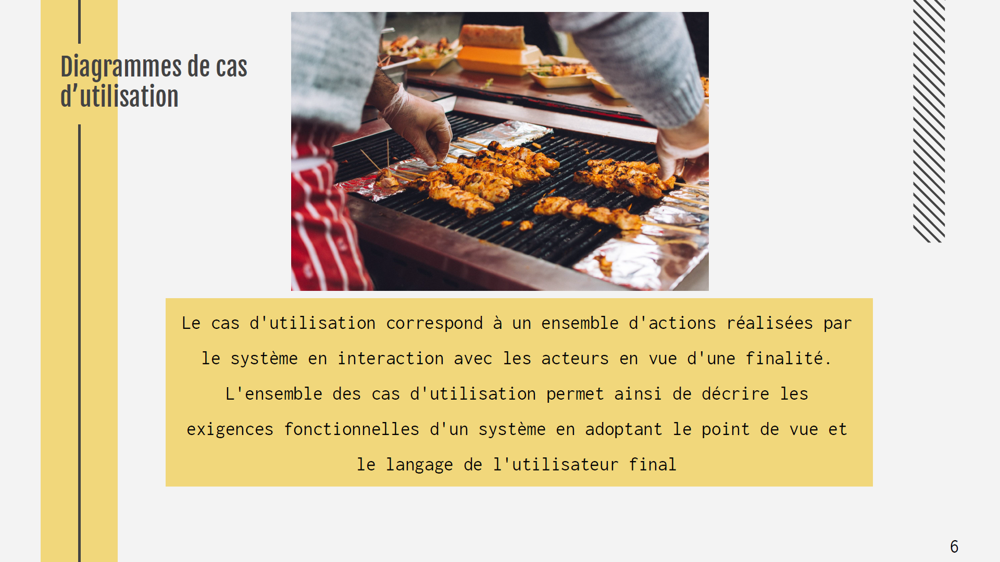

### Cas d’utilisation : Création d’une commande
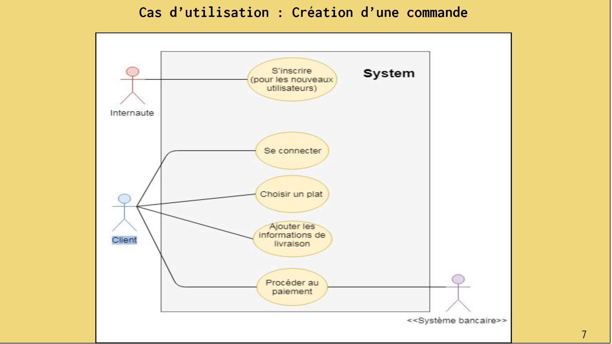

### Cas d’utilisation : Livraison d’une commande
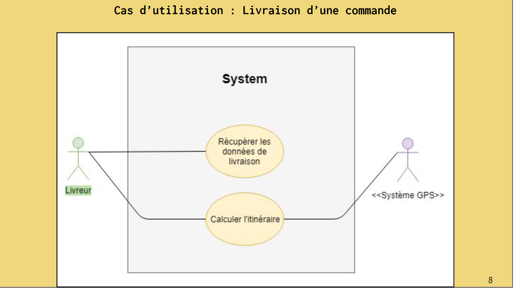

### Cas d’utilisation : Ajout d’un plat du jour
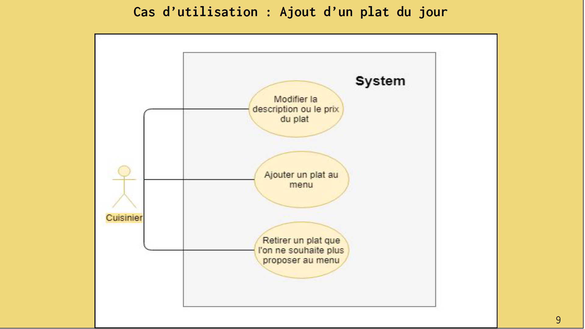

### Diagrammes de séquence
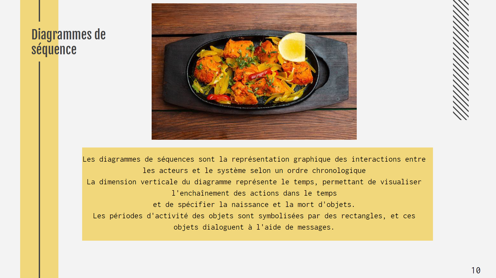
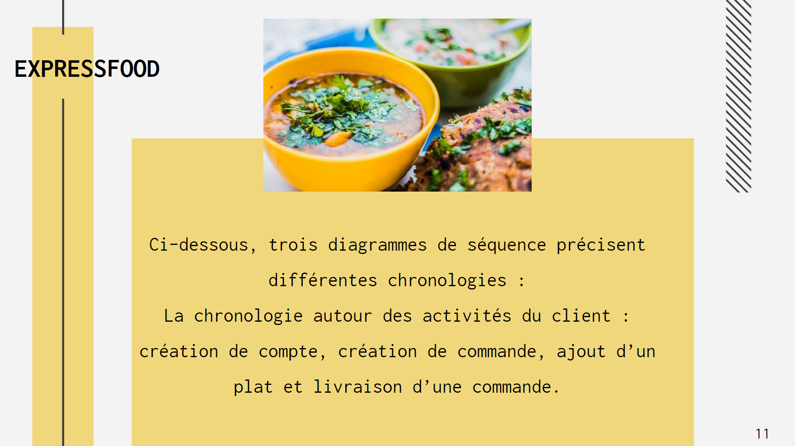

### Diagramme de séquence : Création de compte
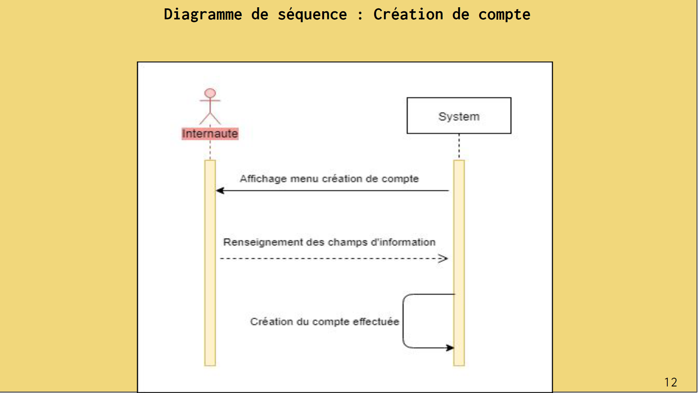

### Diagramme de séquence : Création d’une commande
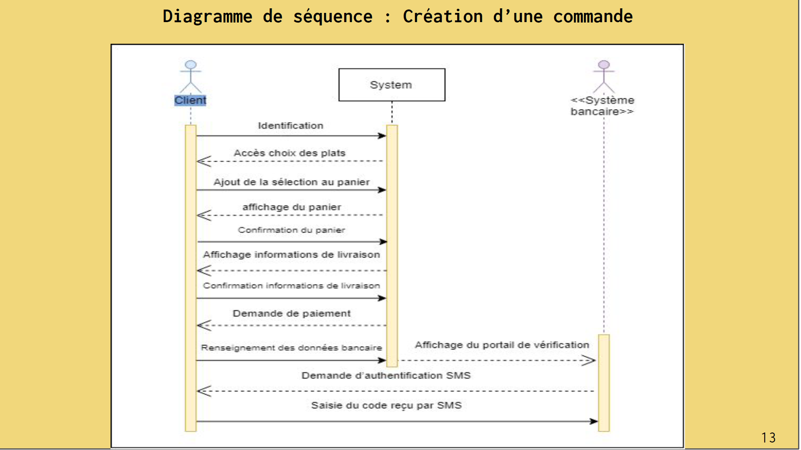

### Diagramme de séquence : ajout d’un plat
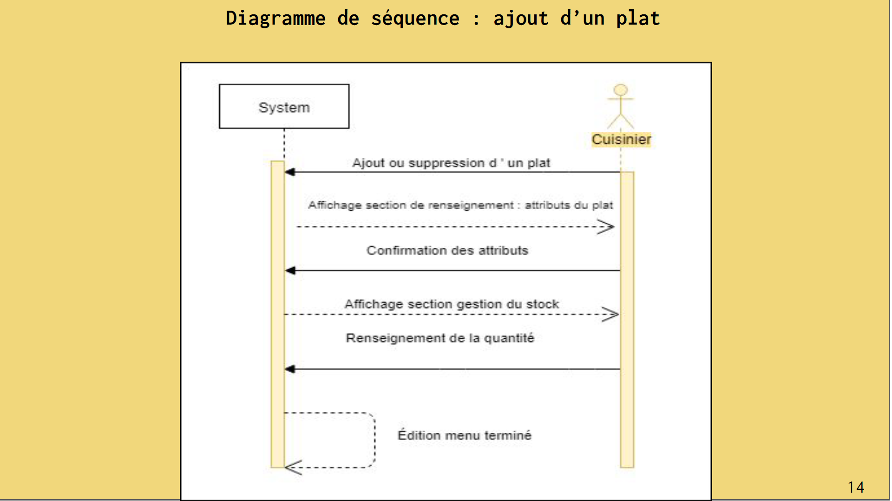

### Diagramme de séquence : Livraison d’une commande
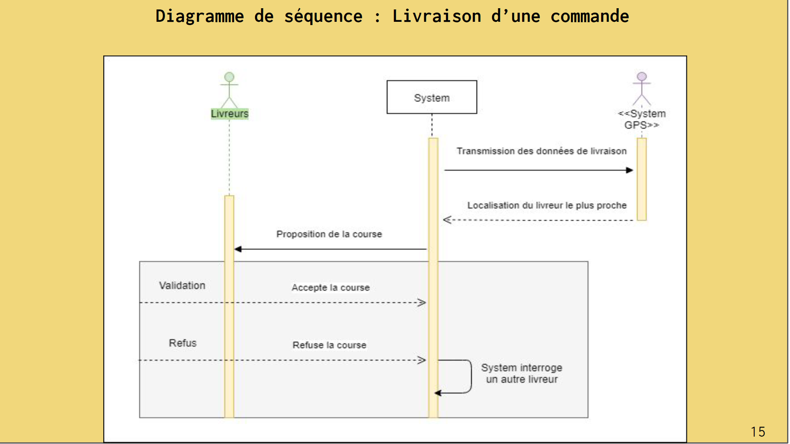

## Diagramme de classe
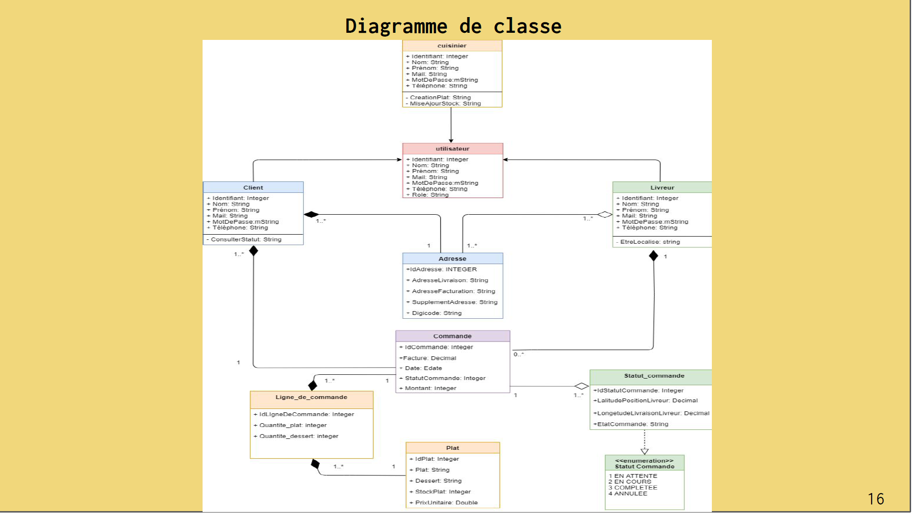

## Modèle physique de données
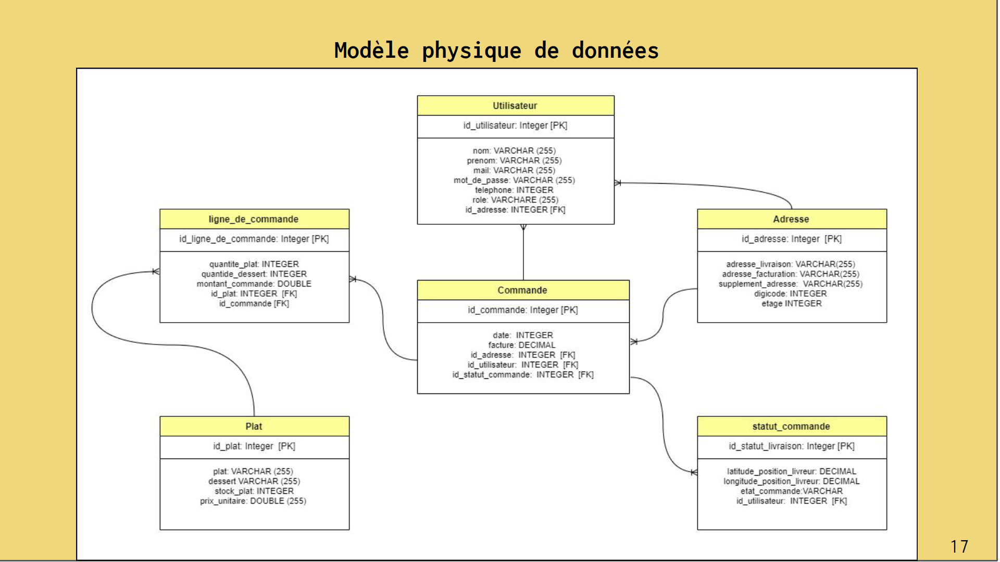

# Fin de la présentation
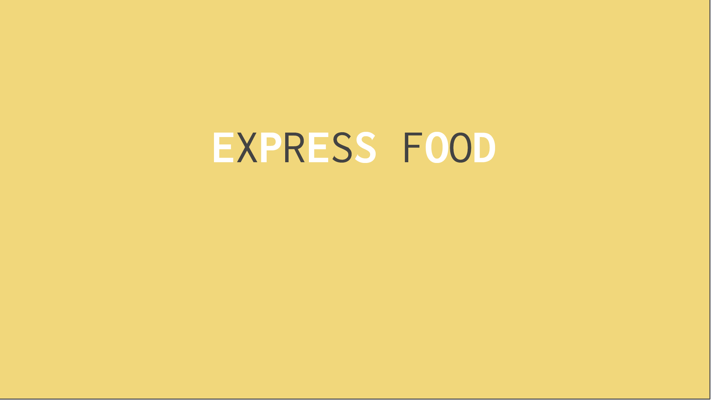

